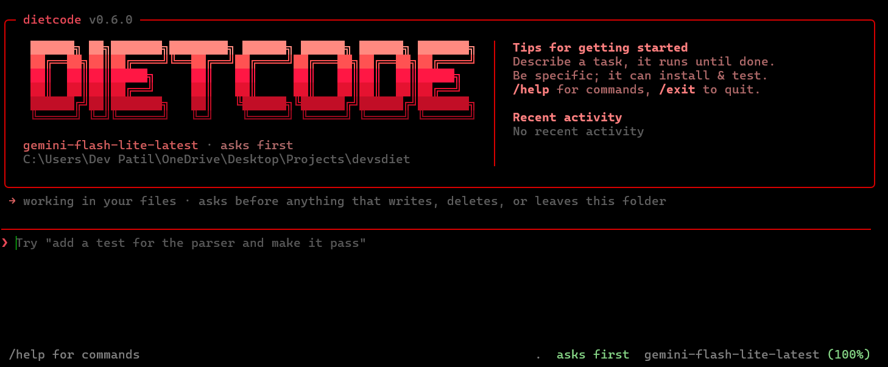

# CLI Coding Agent

A command-line coding agent: an agentic loop with tool-calling that reads and
writes files and runs shell commands until a task is done, in the directory you
are standing in, asking before each change. No agent framework, just raw
OpenAI-compatible API calls and a hand-rolled loop.

Benchmarked against Terminal-Bench.



## Install

```bash
pipx install dietcode
```

Needs **Python 3.11+**. Nothing else to install.

`pipx` is recommended because it puts `dietcode` on your PATH and keeps its
dependencies isolated. `pip install --user dietcode` works too, but on Windows
you may then need to add `%APPDATA%\Python\Python311\Scripts` to PATH yourself.

```bash
dietcode doctor         # checks Python, PATH and credentials
```

Then log in once:

```bash
dietcode login          # pick a provider, paste a key (input is hidden)
dietcode auth           # check what is configured
```

The key goes into your **OS keychain** (Windows Credential Manager, macOS
Keychain, Secret Service on Linux), falling back to a `0600` file at
`~/.dietcode/credentials.json`. It is never written into the project.

| Provider | Free tier | Get a key |
| --- | --- | --- |
| `groq` | yes, generous | [console.groq.com/keys](https://console.groq.com/keys) |
| `gemini` | yes | [aistudio.google.com/apikey](https://aistudio.google.com/apikey) |
| `openai` | no | [platform.openai.com](https://platform.openai.com/api-keys) |

Any OpenAI-compatible endpoint works via `--base-url` (Ollama, vLLM, OpenRouter).

Now run it from anywhere:

```bash
cd ~/some-project
dietcode
```

It works in the directory you are standing in, and asks before anything that
writes, deletes, or reaches outside it.

<details>
<summary>Running from a checkout instead</summary>

```bash
git clone https://github.com/DevPatils/dietCode.git
cd dietCode
pip install -e ".[dev]"
python cli.py                         # same code as the installed command
```

A `.env` with `GROQ_API_KEY=...` also works when running from a checkout.

</details>

**Troubleshooting.** `dietcode doctor` diagnoses all of these:

| Symptom | Cause |
| --- | --- |
| `dietcode: command not found` | its Scripts/bin dir is not on PATH, use `pipx` |
| `no credentials for ...` | run `dietcode login` |
| every action is denied | stdin is not a terminal, so nothing can answer the prompt |
| `daily quota used up` | that model's free tier is spent, switch with `/model` |

## How it decides what it may do

**The default asks.** Read-only commands (`ls`, `cat`, `git status`) run without
prompting; anything that writes, deletes, or reaches outside the directory stops
first with `[enter] yes  [a] always allow  [n] no`. Enter approves, because
approving reads is most of what the prompt does. It does not approve destructive
commands or anything outside the working directory, where a reflex keypress
should not be enough.

**How much it does before asking is a mode**, set with `--mode` or `/mode`:

| Mode | |
| --- | --- |
| `manual` | ask before every command and every write (default) |
| `accept-edits` | write files freely, still ask before running commands |
| `plan` | read and think, change nothing |
| `auto` | do everything without asking (`--yes` is the same thing) |

`accept-edits` covers writes *inside* the working directory only. `plan` refuses
without prompting, because a prompt you are not allowed to say yes to is theatre,
and it tells the model it is planning so it describes the change instead of
retrying.

**Every file change is snapshotted first**, so the looser modes are recoverable.
`/undo` puts the last one back, `/undo all` reverts everything this session
touched, and `/changes` lists them. Shell commands are not tracked: guessing
which paths a command will write is worse than being clear that undo covers file
tools only.

A prompt is a decision, not a boundary. A shell command can always `cd ..`, so
what protects you here is seeing what is about to happen and being able to put it
back, not being unable to leave the folder. Do not point it at code you actively
distrust.

## Usage

Run with no arguments for an interactive session in the current directory:

```bash
dietcode
```

One session keeps its conversation and its files. The agent remembers
what it did on previous turns and the files it built are still there. Ctrl+C
interrupts a turn without quitting.

| Command | |
| --- | --- |
| `/help` | the list |
| `/mode` | how much it may do before asking |
| `/undo`, `/changes` | put back a file it changed; see what it touched |
| `/sessions`, `/fork` | past conversations here; branch this one |
| `/model`, `/provider` | switch either, mid-session |
| `/cost`, `/files` | tokens spent, files in the working directory |
| `/clear` | forget the conversation, keep the files |
| `/login`, `/logout`, `/auth`, `/doctor` | credentials and setup |
| `/exit` | quit (also Ctrl+D) |

Or pass a task to run once and exit, which is what scripting and the benchmark
use:

```bash
dietcode "add a test for the parser and make it pass"
```

### Sessions

Every conversation is written to a JSONL transcript under
`~/.dietcode/projects/<project>/`, not into your repo, because a transcript
holds every file the agent read and every line of shell output.

```bash
dietcode --continue                # carry on the last conversation here
dietcode --resume                  # pick one from a list
dietcode --resume 20260806-1045    # or by id, any unambiguous prefix
dietcode --fork 20260806-1045      # branch it; the original is untouched
```

One-shot runs are sessions too, so `dietcode "do a thing"` then
`dietcode --continue` works. `--no-save` writes nothing.

### Making it prove it is done

```bash
dietcode --verify "python -m pytest -q" "fix the failing parser test"
```

`task_complete` then does not end the run until that command exits 0. A failure
goes back to the model with its output. Without it, "done" is the model's
opinion.

### What it remembers

On your first prompt in a project with no instructions file, dietcode creates
`DIETCODE.md`, standing instructions prepended to every session. Fill it in and
every run picks it up. It also keeps its own notes in
`~/.dietcode/projects/<project>/memory/memory.md`, which it may write and you may
edit; your instructions file stays read-only to it, so a run cannot rewrite its
own brief.

| Flag | Meaning |
| --- | --- |
| `--mode manual\|accept-edits\|plan\|auto` | how much it does before asking |
| `--verify CMD` | command that must exit 0 before it may finish |
| `--continue` / `--resume [ID]` / `--fork ID` | session handling |
| `--no-save` / `--no-snapshots` / `--no-notes` | turn off transcripts / undo / notes |
| `--steps` | show step separators |
| `--no-stream` | wait for each reply instead of showing it as it is generated |
| `--subagents` | let the agent delegate self-contained work to sub-agents |
| `--no-context` | ignore the project's `DIETCODE.md` / `AGENTS.md` / `CLAUDE.md` |
| `--provider groq\|gemini\|openai` | which API to use (default: your saved login) |
| `--base-url URL` | any OpenAI-compatible endpoint (Ollama, vLLM, OpenRouter) |
| `--max-tokens N` | hard spend ceiling per task |
| `--context-budget N` | trim the oldest turns above this prompt size (default 48000) |
| `--yes` | approve every action without asking (dangerous) |
| `--model NAME` | override the provider's default |
| `--max-iterations N` | default 12 |
| `--json` | print metrics as JSON |
| `--quiet` | only print the final result |

Exit code is 0 when the agent called `task_complete`, 1 otherwise.

## Tests

```bash
python -m pytest                        # the whole suite
python -m pytest tests/test_loop.py     # one file
python -m pytest -k timeout             # one test
```

The loop tests use a scripted fake client (`tests/fake_llm.py`), so the suite
needs no API key and makes no network calls.

## How it works

```
interactive ─┐
one-shot   ──┼─> agent_loop ──> execute_tool ──> Executor ──> your files
tb run     ──┘   (agent/loop.py)  (agent/tools.py)  (agent/sandbox.py)
```

All three entrypoints run the same loop, and differ only in which `Executor` is
passed to it. Interactive mode also feeds the previous turn's `messages` back in
as `history`. Rendering lives in `agent/ui.py` so the loop stays UI-free and the
benchmark can run it with no console attached.

Replies stream token by token in both human-facing modes. `agent_loop(stream=…)`
defaults to **off**, and the benchmark leaves it off deliberately: streaming
means reassembling tool calls from fragments, which is strictly more machinery
to go wrong, and a scored run gains nothing from output nobody watches. Both
transports normalize to the same `Completion`, so the loop itself is identical
either way.

`agent_loop` calls the model, executes whatever tools it asks for, feeds the
results back, and repeats until `task_complete`, a turn with no tool calls, or
`max_iterations`.

**Tools:** `read_file`, `write_file`, `edit_file`, `find_files`, `search`,
`run_shell`, `task_complete`, plus `spawn_subagent` behind `--subagents`.

`edit_file` replaces an exact snippet rather than rewriting the file, so a
one-line change costs one line instead of four hundred. It refuses rather than
guesses: no match, or an ambiguous match, is an error explaining what to fix.

`--subagents` lets the agent delegate self-contained work to a fresh agent that
shares the files but not the conversation, and reports back only a summary.
The context isolation is the point. Passing the transcript back would cost as
much as doing the work inline.

**Project instructions.** If the working directory has a `DIETCODE.md`,
`AGENTS.md`, `CLAUDE.md` or `.cursorrules`, it is appended to the system prompt
and takes precedence over the defaults. Read from the host, so the agent can't
rewrite its own standing orders. `--no-context` skips it.

The only thing that differs between the CLI and the benchmark is which `Executor`
gets passed in, so both run identical tool code.

### Notes from building it

- **`execute_tool` never raises.** Llama and Qwen emit malformed tool-call JSON,
  invented tool names and wrong-typed arguments often enough that treating those
  as exceptions would kill a run several times per benchmark. Every failure comes
  back as an error string the model can read and correct.
- **Tool calls written as prose are recovered.** On the very first real run,
  llama-3.3-70b emitted `<function/run_shell {...}</function>` as message *text*
  rather than through the tool-calling API. The loop saw no tool calls and
  stopped on step 1 with the task untouched. `extract_tool_calls_from_text`
  parses the known text formats, and the recovered call is rewritten into the
  transcript in correct structural form. Counted separately as
  `recovered_tool_calls`, because it measures the model, not the scaffold.
- **File tools go through the executor, not the host filesystem.** Otherwise the
  benchmark agent would read the host while its shell acts in the container.
- **`task_complete` batched with the work gets deferred.** Models often emit
  write + run + `task_complete` in a single turn, declaring the output verified
  before a single tool result existed. One run wrote bash into a `.py` file, got
  a `SyntaxError`, and claimed success in the same breath. It would have scored
  a false pass. The loop now feeds the results back and requires
  `task_complete` on its own turn.
- **Schemas stay permissive where the dispatcher coerces.** Groq validates tool
  arguments server-side and 400s the whole generation on a mismatch; a model
  sending `"timeout": "10"` killed a run. The rejected text comes back in
  `failed_generation`, so the call is salvaged from it rather than lost.
- **The shell wrapper persists the working directory** between calls. Each one
  is a fresh process, so `cd src` in one command would otherwise be silently lost
  by the next, and the agent would be acting blind.
- **Written file content is base64'd over argv**, so nothing the model generates
  can be reinterpreted as shell syntax. Costs a ~1MB write ceiling (`ARG_MAX`).

## Limits and isolation

The agent runs shell commands an LLM wrote, in your own directory. Three things
stand between it and a mess:

**It asks.** Anything that writes, deletes, or reaches outside the working
directory stops for approval, and the strictest segment of a compound command
decides. `git status && rm -rf build` is a destructive command, not a read.

**It keeps a copy.** Every file a tool changes is snapshotted first, so `/undo`
and `/undo all` put things back. Copies live in `~/.dietcode`, never in your
project.

**It records what happened.** The full transcript of every session is on disk, so
you can go back and read exactly which command did what.

None of that is containment. A shell command can leave the folder, and `--yes`
or `--mode auto` turns the asking off entirely. Point it at work you are willing
to review, and read the prompts.

Long sessions trim their own history: above `--context-budget` tokens the oldest
turns are dropped, always keeping tool calls and their results together (splitting
a pair makes the API reject the whole request). Trimming applies to what is
*sent*; the full transcript is still recorded.

## Benchmark

**The harness does not run on Windows.** Use WSL or Linux:

```bash
curl -LsSf https://astral.sh/uv/install.sh | sh   # uv brings its own Python 3.13
uv tool install terminal-bench

wsl bash scripts/benchmark.sh                 # hello-world
wsl bash scripts/benchmark.sh broken-python   # a single task
DATASET=terminal-bench-core==0.1.1 wsl bash scripts/benchmark.sh ""   # everything
```

Docker Desktop's WSL integration means WSL shares the same daemon, so no second
install. The agent itself is fine on Windows; only the harness is not.

<details>
<summary>Four terminal-bench 0.2.18 problems this works around</summary>

1. Its dataset downloader shells out to Unix `rm -rf .git`. Needs Git's
   `usr/bin` on PATH, or just run it on Linux.
2. `terminal-bench-core@head` points at `./tasks`, but the repo moved to
   `harbor-framework/terminal-bench` and renamed that directory
   `original-tasks/`. Pin `==0.1.1` (commit `91e10457b5`).
3. **Windows blocker:** container paths are built with `pathlib.Path`, so `/tmp`
   becomes `\tmp` and the run dies in `TmuxSession.__init__` with
   `404 Could not find the file \tmp`, before the agent is ever called. The
   `0.00%` this produces is not a score; check `total_input_tokens: null` in
   `results.json` to tell "harness failed" from "agent failed".
4. It finishes by printing `output_path.absolute()`, which calls `os.getcwd()`.
   On a OneDrive-backed folder over WSL's drvfs that can throw *after* a
   successful run. Passing an absolute `--output-path` avoids the call.

</details>

`tb` does not read `.env`; the adapter loads it itself, and the script exports
the key as well in case the harness's isolated environment lacks python-dotenv.

Use a fixed 15 to 20 task subset while iterating, not the full suite, and not
repeatedly. Groq's free tier is ~1,000 requests/day and each task burns one
request per loop step.

Per-task `metrics.json` and `transcript.json` are written into the harness's
logging directory; they are the input to the failure-mode table below.

### Results

**Smoke test only so far: one task, which is not a score.**

| Task | Result | Steps | Tokens | Notes |
| --- | --- | --- | --- | --- |
| `hello-world` | ✅ resolved | 3 | 1,806 | 1 tool call recovered from text |

The full subset run is the next step. The table below stays empty until then
rather than extrapolating from a single task.

| | Resolution rate | Avg steps | Avg tokens |
| --- | --- | --- | --- |
| This agent | n/a | n/a | n/a |
| Terminus (reference) | n/a | n/a | n/a |

#### What the first pass showed

Both defensive mechanisms earned their place immediately. From the transcript:

- **Step 1's tool call arrived as prose**, not through the tool-calling API. The
  recovered call is visible in the log as a synthesized id (`call_1_0`) with
  empty content. Without `extract_tool_calls_from_text` the loop would have
  stopped at step 1, `hello.txt` would never have been written, and the task
  would have failed.
- **Step 2 sent `"timeout": "30"`** as a string. That is exactly the payload
  that previously drew a 400 and killed a run; the permissive schema absorbed it.

One task on one model is a smoke test, so treat `recovered_tool_calls` as the
interesting number here, not the pass.

## Status

Built and working end to end: tool dispatch, agent loop, permission gate,
sessions with resume and fork, snapshots and undo, project memory, CLI, and the
Terminal-Bench adapter.

First real run, `"write a python script that prints the first 20 primes and run it"`
on `llama-3.3-70b-versatile`, completed in 4 steps / 4658 tokens:

| Step | What happened |
| --- | --- |
| 1 | Tool call arrived as text; recovered and run. The command itself was malformed (literal `\n` inside `python -c "..."`) → `SyntaxError` |
| 2 | Model read the error, switched to `write_file`, and used a proper structured tool call |
| 3 | Ran the script; correct output |
| 4 | `task_complete` |

Not yet done:
- Stretch goal: `spawn_subagent`, a fresh loop with isolated message history
  that returns only its final summary to the parent. `agent_loop` takes an
  `extra_tool_handlers` hook for exactly this, and the hook is tested; the tool
  itself is deliberately left until there is a baseline score to compare against.
